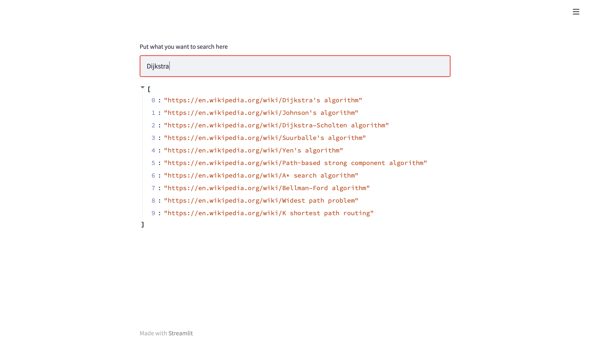

# Search Engine over Wikipedia articles about Algorithms

## Project Intro/Objective
This is my final project for the [Text Mining](https://harbour.space/computer-science/courses/text-mining-sergey-khoroshenkikh-487) course at [Harbour.Space University](https://harbour.space), 2022.

There are a only a few specific categories of algorithms.

## Technologies
- Libraries used: spacy, nltk, numpy, sklearn, streamlit

## Technical Description
- Uses TFIDF vectorizer to vectorize documents.
- Uses KDtrees to index the vectors and execute queries faster.
- Uses Levenshtein Distance and Longest Common Prefix to find the closest words to the words given in the input.
## Getting Started

1. Clone this repo (for help see this [tutorial](https://help.github.com/articles/cloning-a-repository/)).
2. Unzip the file `wiki_data.zip` ZIP file.
3. Make sure to install [streamlit](https://streamlit.io) in your environment.
4. Run from your terminal `python -m spacy download en_core_web_sm`.
5. Run `streamlit run app.py` to start the app. It should open a tab in your browser automatically, where you can search for different algorithms and you'll receive wikipedia links.

## Contact
* Email: anier.velasco@gmail.com
* Telegram: https://t.me/aniervs
* Github: https://github.com/aniervs
* LinkedIn: https://www.linkedin.com/in/aniervs

